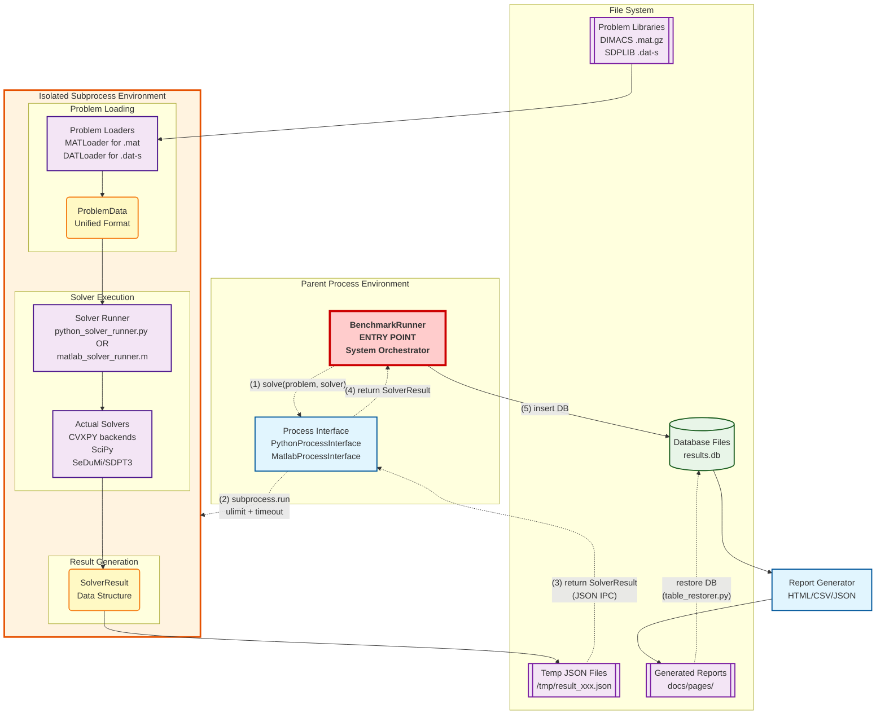

# Optimization Solver Benchmark System - Technical Design

Detailed technical specifications for the optimization solver benchmark system supporting Python and MATLAB solvers across LP, QP, SOCP, and SDP problems.

---

## System Overview

**Purpose**: Benchmark optimization solvers using external problem libraries (DIMACS, SDPLIB) with minimal configuration for unbiased performance evaluation.

**Core Components**:
- **Problem Loaders**: Parse MAT/DAT formats → standardized ProblemData
- **Solver Interfaces**: Execute Python/MATLAB solvers → standardized SolverResult  
- **Database Storage**: SQLite with complete version tracking
- **Report Generation**: HTML dashboards with CSV/JSON export

*For supported solvers, problem libraries, and problem types, see [basic_design.md](basic_design.md).*

---

## Component Architecture

### System Data Flow

#### High-Level Process Flow with Sequential Steps



#### Error Detection and Status Flow

The parent process classifies subprocess outcomes by return code (see `_call_python_solver` in `python_process_interface.py`):

- **Return code 0** → read the JSON result file → normal `SolverResult` (OPTIMAL, etc.)
- **Return code -9/137 (SIGKILL)** → `SIGKILL` result (typically OOM)
- **Timeout expired** → `TIMEOUT` result with the timeout duration
- **Other non-zero codes** → parse stderr/stdout → `SUBPROCESS_ERROR` result

### Component Responsibilities

**BenchmarkRunner** (System Orchestrator)
- Problem loading coordination
- Solver execution management
- Result storage and reporting

**Process Interfaces** (Subprocess Management)
- **PythonProcessInterface**: Python solver execution with resource control
- **MatlabProcessInterface**: MATLAB solver execution with resource control

**Data Components**
- **Problem Loaders**: MAT/DAT format parsers → unified ProblemData
- **DatabaseManager**: SQLite operations with version tracking
- **ReportGenerator**: HTML/CSV/JSON output generation

**Key Architecture Principles:**
- Subprocess isolation for crash protection
- Symmetric Python/MATLAB execution paths
- Timeout enforcement at the subprocess level
- Centralized result storage and metadata tracking

---

## Project Structure

### Directory Layout
```
optimization-solver-benchmark/
├── main.py                     # Entry point with argument parsing
├── config/                     # Configuration files
│   ├── site_config.yaml        # Site metadata and overview
│   └── problem_registry.yaml   # Problem metadata and file paths
├── scripts/
│   ├── benchmark/              # Benchmark execution engine
│   │   ├── __init__.py
│   │   └── runner.py           # Main BenchmarkRunner class
│   ├── solvers/                # Solver interface implementations
│   │   ├── __init__.py
│   │   ├── solver_interface.py # Abstract base classes and SolverResult
│   │   ├── python/             # Python solver implementations (subprocess)
│   │   │   ├── __init__.py
│   │   │   ├── solver_configs.py            # Solver registry (single source of truth)
│   │   │   ├── python_process_interface.py  # Python subprocess coordinator
│   │   │   ├── python_solver_runner.py      # Subprocess entry point + solver manager
│   │   │   ├── cvxpy_runner.py              # CVXPY backend handler
│   │   │   └── scipy_runner.py              # SciPy linprog handler
│   │   └── matlab/      # MATLAB integration (subprocess)
│   │       ├── __init__.py
│   │       ├── matlab_process_interface.py  # Python-MATLAB subprocess bridge
│   │       ├── matlab_solver_runner.m       # MATLAB subprocess entry point
│   │       ├── sedumi_runner.m              # SeDuMi solver wrapper
│   │       ├── sdpt3_runner.m               # SDPT3 solver wrapper
│   │       ├── setup_matlab_solvers.m       # MEX compilation script
│   │       ├── sedumi/         # SeDuMi solver (git submodule)
│   │       └── sdpt3/          # SDPT3 solver (git submodule)
│   ├── data_loaders/           # Problem format loaders
│   │   ├── __init__.py
│   │   ├── problem_loader.py   # ProblemData class definition
│   │   ├── python/             # Python format loaders
│   │   │   ├── __init__.py
│   │   │   ├── problem_interface.py  # Problem loading coordinator
│   │   │   ├── mat_loader.py         # DIMACS .mat loader
│   │   │   └── dat_loader.py         # SDPLIB .dat-s loader
│   │   └── matlab/      # MATLAB format loaders
│   │       ├── mat_loader.m    # MATLAB .mat loader
│   │       └── dat_loader.m    # MATLAB .dat-s loader
│   ├── database/               # Database management
│   │   ├── __init__.py
│   │   ├── database_manager.py # Database operations
│   │   ├── models.py           # Data models
│   │   └── schema.sql          # Database schema
│   ├── reporting/              # Report generation
│   │   ├── __init__.py
│   │   ├── html_generator.py   # HTMLGenerator facade (public API)
│   │   ├── report_base.py      # Shared base class and HTML/CSS helpers
│   │   ├── overview_report.py  # Overview dashboard (index.html)
│   │   ├── results_matrix_report.py # Problems × Solvers matrix
│   │   ├── raw_data_report.py  # Raw data table
│   │   ├── data_index_report.py # Data export index page
│   │   ├── result_processor.py # Result aggregation
│   │   └── data_exporter.py    # JSON/CSV export
│   └── utils/                  # Utility modules (logging, env info, git, temp files)
├── tests/                      # pytest test suite
│   ├── unit/                   # Unit tests (synthetic fixtures, no submodules needed)
│   └── integration/            # Problem registry integrity checks
├── problems/                   # Problem library files
│   ├── DIMACS/                 # External DIMACS library (git submodule)
│   └── SDPLIB/                 # External SDPLIB library (git submodule)
├── database/                   # SQLite database files (results.db, gitignored)
├── docs/
│   ├── pages/                  # Generated HTML reports and data exports
│   ├── development/            # Design documents
│   └── guides/                 # User/setup guides
├── pyproject.toml              # pytest and ruff configuration
└── requirements.txt            # Python dependencies (single file, all pinned)
```

---

## Core Data Models

### ProblemData (`scripts/data_loaders/problem_loader.py`)

Unified problem representation in SeDuMi standard form: equality constraints (`A_eq`, `b_eq`), objective `c`, cone structure (free / nonnegative / SOC / SDP), optional quadratic term `P`, plus name, problem class, and metadata. All format loaders convert into this structure.

### SolverResult (`scripts/solvers/solver_interface.py`)

Standardized dataclass returned by every solver: `solve_time`, `status`, primal/dual objective values, duality gap, primal/dual infeasibility, iterations, solver name/version, and an `additional_info` dict. Factory methods (`create_error_result`, `create_timeout_result`, `create_sigkill_result`, `create_subprocess_error_result`, `create_unsupported_result`) build consistent results for each failure mode.

**Status codes**:

| Status | Meaning |
|--------|---------|
| `OPTIMAL` | Solver found an optimal solution |
| `OPTIMAL (INACCURATE)` | Solution found but with numerical warnings |
| `ERROR` | Solver-level error (convergence failure, numerical issues) |
| `NUM_ERROR` | Numerical difficulties (matrix singularity, divergence) |
| `STALLED` | Algorithm progress stagnated (can retry with different params) |
| `MAX_ITER` | Maximum iteration limit reached |
| `INFEASIBLE` | Problem has no feasible solution |
| `UNBOUNDED` | Problem is unbounded |
| `UNSUPPORTED` | Problem type not supported by the solver |
| `TIMEOUT` | Execution time limit exceeded |
| `SIGKILL` | Process forcibly terminated (typically OOM) |
| `SUBPROCESS_ERROR` | Subprocess execution error (crash, library issues) |
| `UNKNOWN` | Unclear solver state |

**`additional_info['original_status']`** preserves complete solver-specific status information for reproducibility:
- MATLAB solvers (SDPT3/SEDUMI): `termcode`/`pinf`/`dinf`/`numerr` (original solver status codes), `iter` (iteration count), `full_info` (complete solver info structure)
- Python solvers (CVXPY/SciPy): `cvxpy_status`/`scipy_status` (original solver status), `solver_stats` (complete backend statistics), backend-specific metrics (`solve_time`, `num_iters`, etc.)

---

## Configuration Specifications

### Problem Registry Structure

**Problem Configuration Schema:**
```yaml
# config/problem_registry.yaml structure
problem_name:
  display_name: string          # Human-readable problem name
  file_path: string            # Relative path to problem file
  file_type: string            # "mat" | "dat-s" (supported formats: ProblemInterface.FORMAT_LOADERS)
  library_name: string         # "DIMACS" | "SDPLIB"
  for_test_flag: boolean       # Mark problem for validation testing
```

### Solver Interface Specifications

`PythonProcessInterface` and `MatlabProcessInterface` expose the same `solve(problem_name, solver_name, timeout=...)` method returning a `SolverResult`, keeping the two ecosystems symmetric.

### Subprocess Architecture Design

**Key Design Principles:**
- **Process Isolation**: All solver execution in separate subprocesses for crash protection
- **Timeout Control**: enforced via `subprocess.run(timeout=...)` in the parent process. A memory-limit mechanism exists in the subprocess entry point (`--memory-limit`, `resource.setrlimit`) but is currently not passed by the process interfaces
- **Unified Error Detection**: Standardized error classification across Python/MATLAB
- **JSON Communication**: Structured data exchange between parent and subprocess

---

## Database Implementation

### Schema

A single denormalized `results` table (see `scripts/database/schema.sql`): solver name/version, problem library/name/type, environment info (JSON), git commit hash, timestamp, and the standardized solver result fields (solve time, status, objective values, gap, infeasibilities, iterations, memo). Rows are append-only with a UNIQUE constraint on (solver, version, library, problem, commit, timestamp).

### Database Operations

**Core Operations:**
- **Result Storage**: Store SolverResult with complete metadata (environment, version, timing)
- **Query Interface**: Retrieve results by solver, problem, or time period
- **Version Tracking**: Maintain historical data with Git commit association

---

## Report Generation

**Report Types:**
- **Dashboard**: Static HTML reports (inline CSS, no JS frameworks)
- **Results Matrix**: Problems × Solvers performance matrix
- **Data Export**: JSON/CSV formats for research use

**Output Formats:**
- HTML reports published to GitHub Pages
- JSON/CSV data files for programmatic access

---

## Fair Benchmarking Implementation

*For benchmarking philosophy and principles, see [basic_design.md](basic_design.md#design-philosophy).*

**Technical Implementation:**
- Solver configuration limited to output suppression (`verbose: false`)
- Unified resource limits via subprocess isolation
- Comprehensive version tracking in database metadata

---

## System Interface

### Timeout Control
- **Default timeout**: 120 seconds for most problems
- **Configurable limits**: Adjustable via command-line arguments
- **Subprocess isolation**: Timeout enforcement at process level

### Command-Line Interface

**Argument Processing:**
- **Problem Selection**: `--problems` (specific), `--library_names` (by library)
- **Solver Selection**: `--solvers` (specific), defaults to all available
- **Resource Control**: `--timeout` (seconds), propagated through all execution layers
- **Execution Modes**: `--benchmark`, `--validate`, `--report`, `--dry-run`

*For usage examples, see [basic_design.md](basic_design.md#problem-library-setup).*

---

## Development Guidelines

### Adding New Python Solvers
1. **Add an entry** to `scripts/solvers/python/solver_configs.py` (single source of truth; for a new CVXPY backend this is the only code change)
2. **Create a runner class** only if the solver is not a CVXPY backend (see `cvxpy_runner.py` / `scipy_runner.py`), and register it in `RUNNER_CLASSES` in `python_solver_runner.py`
3. **Add the dependency** to `requirements.txt` and the solver name to `display_order` in `config/site_config.yaml`
4. **Verify** with `python main.py --validate`

### Adding New MATLAB Solvers
1. **Create solver runner** `{solver}_runner.m` following standard interface
2. **Add configuration** to `MATLAB_SOLVER_CONFIGS` in `matlab_process_interface.py`
3. **Implement MEX compilation** in `setup_matlab_solvers.m`
4. **Verify** with `python main.py --validate`

### Adding New Problem Formats
1. **Create loader classes** in both `python/` and `matlab/` directories
2. **Add format mapping** to `FORMAT_LOADERS` in `problem_interface.py`
3. **Update problem registry** to include new format problems
4. **Implement format conversion** to unified SeDuMi format