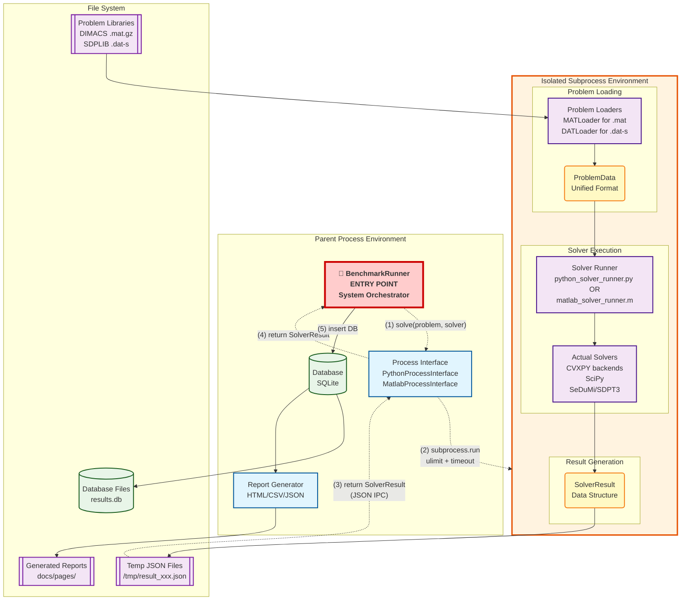

# Optimization Solver Benchmark System - Technical Design

Detailed technical specifications for the optimization solver benchmark system supporting Python and MATLAB/Octave solvers across LP, QP, SOCP, and SDP problems.

---

## System Overview

**Purpose**: Benchmark optimization solvers using external problem libraries (DIMACS, SDPLIB) with minimal configuration for unbiased performance evaluation.

**Core Components**:
- **Problem Loaders**: Parse MAT/DAT formats → standardized ProblemData
- **Solver Interfaces**: Execute Python/MATLAB solvers → standardized SolverResult  
- **Database Storage**: SQLite with complete version tracking
- **Report Generation**: HTML dashboards with CSV/JSON export

**Supported Systems**:
- **Python Solvers (9)**: SciPy, CVXPY backends (CLARABEL, SCS, ECOS, OSQP, CVXOPT, SDPA, SCIP, HIGHS)
- **MATLAB/Octave Solvers (2)**: SeDuMi, SDPT3
- **Problem Types**: LP, QP, SOCP, SDP (139 problems total)

---

## Project Structure

### Directory Layout
```
optimization-solver-benchmark/
├── main.py                     # Entry point with argument parsing
├── config/                     # Configuration files
│   ├── site_config.yaml        # Site metadata and overview
│   └── problem_registry.yaml   # Problem metadata and file paths
├── scripts/
│   ├── benchmark/              # Benchmark execution engine
│   │   ├── __init__.py
│   │   └── runner.py           # Main BenchmarkRunner class
│   ├── solvers/                # Solver interface implementations
│   │   ├── __init__.py
│   │   ├── solver_interface.py # Abstract base classes and SolverResult
│   │   ├── python/             # Python solver implementations (subprocess)
│   │   │   ├── __init__.py
│   │   │   ├── python_process_interface.py  # Python subprocess coordinator
│   │   │   ├── python_solver_runner.py      # Subprocess entry point + solver manager
│   │   │   ├── cvxpy_runner.py              # CVXPY backend handler
│   │   │   └── scipy_runner.py              # SciPy linprog handler
│   │   └── matlab_octave/      # MATLAB/Octave integration (subprocess)
│   │       ├── __init__.py
│   │       ├── matlab_process_interface.py  # Python-MATLAB subprocess bridge
│   │       ├── matlab_solver_runner.m       # MATLAB subprocess entry point
│   │       ├── sedumi_runner.m              # SeDuMi solver wrapper
│   │       ├── sdpt3_runner.m               # SDPT3 solver wrapper
│   │       ├── setup_matlab_solvers.m       # MEX compilation script
│   │       ├── sedumi/         # SeDuMi solver (git submodule)
│   │       └── sdpt3/          # SDPT3 solver (git submodule)
│   ├── data_loaders/           # Problem format loaders
│   │   ├── __init__.py
│   │   ├── problem_loader.py   # ProblemData class definition
│   │   ├── python/             # Python format loaders
│   │   │   ├── __init__.py
│   │   │   ├── problem_interface.py  # Problem loading coordinator
│   │   │   ├── mat_loader.py         # DIMACS .mat loader
│   │   │   └── dat_loader.py         # SDPLIB .dat-s loader
│   │   └── matlab_octave/      # MATLAB format loaders
│   │       ├── mat_loader.m    # MATLAB .mat loader
│   │       └── dat_loader.m    # MATLAB .dat-s loader
│   ├── database/               # Database management
│   │   ├── __init__.py
│   │   ├── database_manager.py # Database operations
│   │   ├── models.py           # Data models
│   │   └── schema.sql          # Database schema
│   ├── reporting/              # Report generation
│   │   ├── __init__.py
│   │   ├── html_generator.py   # HTML report creation
│   │   ├── result_processor.py # Result aggregation
│   │   └── data_exporter.py    # JSON/CSV export
│   └── utils/                  # Utility modules
│       ├── __init__.py
│       ├── environment_info.py # System information capture
│       ├── git_utils.py        # Git operations
│       ├── logger.py           # Logging configuration
│       ├── resource_limits.py  # Memory/CPU limitation utilities
│       └── temp_file_manager.py # Temporary file handling
├── problems/                   # Problem library files
│   ├── DIMACS/                 # External DIMACS library (git submodule)
│   └── SDPLIB/                 # External SDPLIB library (git submodule)
├── database/                   # SQLite database files
│   └── results.db              # Benchmark results storage
├── docs/                       # Generated reports and documentation
│   ├── pages/                  # Generated HTML reports
│   │   ├── index.html          # Main dashboard
│   │   ├── results_matrix.html # Problems × Solvers matrix
│   │   ├── raw_data.html       # Detailed data view
│   │   └── data/               # Exported data files
│   │       ├── benchmark_results.json
│   │       ├── benchmark_results.csv
│   │       └── summary.json
│   └── development/            # Development documentation
└── requirements.txt            # Python dependencies
```

---

## Component Architecture

### System Data Flow

#### High-Level Process Flow with Sequential Steps



#### Node Legend and Execution Flow
- **🔴 Entry Point** `[]` (Red): **BenchmarkRunner** - Main system orchestrator and entry point
- **🔵 Processes** `[]` (Blue): Active execution components - Process Interface, Report Generator, Solvers
- **🟡 Internal Data** `()` (Yellow): Temporary in-memory data structures - ProblemData, SolverResult  
- **🟢 Database Storage** `[()]` (Green): Persistent structured data - SQLite Database, Database Files
- **🟣 Document Files** `[[]]` (Purple): File-based documents - Problem Libraries, JSON Files, Generated Reports

#### Sequential Execution Steps
1. **(1) solve(problem, solver)**: BenchmarkRunner calls Process Interface with problem and solver names
2. **(2) subprocess.run**: Process Interface launches isolated subprocess with ulimit + timeout controls
3. **(3) return SolverResult (JSON IPC)**: Subprocess writes JSON result file, Process Interface reads and converts
4. **(4) return SolverResult**: Process Interface returns standardized SolverResult object to BenchmarkRunner
5. **(5) insert DB**: BenchmarkRunner stores result with complete metadata in SQLite database


#### Error Detection and Status Flow
```
SUBPROCESS EXECUTION RESULTS:
┌─────────────────────┐    ┌─────────────────────┐    ┌─────────────────────┐
│ Return Code 0       │───▶│ Read JSON Result    │───▶│ Normal SolverResult │
│ (Success)           │    │ File                │    │ (OPTIMAL, etc.)     │
└─────────────────────┘    └─────────────────────┘    └─────────────────────┘

┌─────────────────────┐    ┌─────────────────────┐    ┌─────────────────────┐
│ Return Code -9/137  │───▶│ No JSON needed      │───▶│ SIGKILL Result      │
│ (SIGKILL)           │    │ (Process killed)    │    │ + Memory Limit Info │
└─────────────────────┘    └─────────────────────┘    └─────────────────────┘

┌─────────────────────┐    ┌─────────────────────┐    ┌─────────────────────┐
│ Timeout Expired     │───▶│ No JSON needed      │───▶│ TIMEOUT Result      │
│ (Process killed)    │    │ (Process killed)    │    │ + Timeout Duration  │
└─────────────────────┘    └─────────────────────┘    └─────────────────────┘

┌─────────────────────┐    ┌─────────────────────┐    ┌─────────────────────┐
│ Return Code ≠ 0     │───▶│ Parse stderr/stdout │───▶│ SUBPROCESS_ERROR    │
│ (Other errors)      │    │ for error details   │    │ + Error Message     │
└─────────────────────┘    └─────────────────────┘    └─────────────────────┘
```

### Component Hierarchy - BenchmarkRunner as System Entry Point

```
🚀 BenchmarkRunner (scripts/benchmark/runner.py) ← MAIN ENTRY POINT
│
├── (1) Problem Loading (called by BenchmarkRunner)
│   └── ProblemInterface (scripts/data_loaders/python/problem_interface.py)
│       ├── MATLoader (scripts/data_loaders/python/mat_loader.py)
│       └── DATLoader (scripts/data_loaders/python/dat_loader.py)
│
├── (2) Solver Execution (delegated to Process Interfaces)
│   ├── PythonProcessInterface (scripts/solvers/python/python_process_interface.py)
│   │   └── subprocess isolation → python_solver_runner.py
│   │       ├── PythonSolverManager (internal solver management)
│   │       ├── CvxpyRunner (scripts/solvers/python/cvxpy_runner.py)
│   │       └── ScipyRunner (scripts/solvers/python/scipy_runner.py)
│   └── MatlabProcessInterface (scripts/solvers/matlab_octave/matlab_process_interface.py)
│       └── subprocess isolation → matlab_solver_runner.m
│           ├── sedumi_runner.m
│           └── sdpt3_runner.m
│
├── (3) Resource Control (applied during subprocess execution)
│   └── ResourceLimits (scripts/utils/resource_limits.py)
│       └── ulimit-based memory/CPU control
│
├── (4) Result Storage (controlled by BenchmarkRunner)
│   └── DatabaseManager (scripts/database/database_manager.py)
│       └── SQLite database operations
│
└── (5) Report Generation (initiated by BenchmarkRunner)
    └── ResultProcessor (scripts/reporting/result_processor.py)
        └── HTML/CSV/JSON report generation

Key Architecture Principles:
• BenchmarkRunner orchestrates the entire execution flow
• Process Interfaces provide subprocess isolation for crash protection
• All database operations are controlled by BenchmarkRunner
• Resource limits applied consistently across Python and MATLAB solvers
• Symmetric architecture between Python and MATLAB execution paths
```

---

## Core Data Models

### Problem Data Structure
```python
# scripts/data_loaders/problem_loader.py
class ProblemData:
    """Unified problem representation using SeDuMi format"""
    def __init__(self, name: str, problem_class: str):
        self.name = name                     # Problem identifier
        self.problem_class = problem_class   # 'LP', 'QP', 'SOCP', 'SDP'
        
        # SeDuMi standard format (internal representation)
        self.A_eq = None          # Constraint matrix (sparse)
        self.b_eq = None          # RHS vector
        self.c = None             # Objective coefficients
        self.cone_structure = {}  # Cone constraints specification
        
        # Optional QP data
        self.P = None             # Quadratic term matrix
        
        # Problem metadata
        self._num_variables = 0
        self._num_constraints = 0
        self.metadata = {}        # Additional problem information
```

### Solver Result Structure (Enhanced Error Detection)
```python
# scripts/solvers/solver_interface.py
@dataclass
class SolverResult:
    """Standardized result format for all solvers with comprehensive error detection"""
    solve_time: float                        # Execution time in seconds
    status: str                              # Status codes (see below)
    primal_objective_value: Optional[float] = None
    dual_objective_value: Optional[float] = None
    duality_gap: Optional[float] = None
    primal_infeasibility: Optional[float] = None
    dual_infeasibility: Optional[float] = None
    iterations: Optional[int] = None
    solver_name: Optional[str] = None
    solver_version: Optional[str] = None
    additional_info: Optional[Dict[str, Any]] = None
    
    # Status codes with clear error distinction:
    # OPTIMAL         - Solver found optimal solution
    # ERROR           - Solver-level error (convergence failure, numerical issues)
    # UNSUPPORTED     - Problem type not supported by solver
    # TIMEOUT         - Execution time limit exceeded
    # SIGKILL         - Process forcibly terminated (OOM, manual kill, resource limits)
    # SUBPROCESS_ERROR - Subprocess execution error (Python crash, library issues)
    
    @classmethod
    def create_error_result(cls, error_msg: str, solve_time: float = 0.0,
                          solver_name: str = "unknown", solver_version: str = "unknown") -> 'SolverResult':
        """Create standardized solver-level error result"""
        return cls(solve_time=solve_time, status='ERROR', 
                  solver_name=solver_name, solver_version=solver_version,
                  additional_info={'error_message': error_msg})
    
    @classmethod
    def create_timeout_result(cls, timeout_duration: float, solver_name: str = "unknown",
                            solver_version: str = "unknown") -> 'SolverResult':
        """Create standardized timeout result"""
        return cls(solve_time=timeout_duration, status='TIMEOUT',
                  solver_name=solver_name, solver_version=solver_version,
                  additional_info={'timeout_duration': timeout_duration})
    
    @classmethod
    def create_sigkill_result(cls, memory_limit_gb: Optional[float] = None, 
                            solve_time: float = 0.0, solver_name: str = "unknown",
                            solver_version: str = "unknown", error_details: str = "") -> 'SolverResult':
        """Create standardized SIGKILL result (process forcibly terminated)"""
        additional_info = {'error_type': 'SIGKILL', 'error_details': error_details}
        if memory_limit_gb is not None:
            additional_info['memory_limit_gb'] = memory_limit_gb
        return cls(solve_time=solve_time, status='SIGKILL',
                  solver_name=solver_name, solver_version=solver_version,
                  additional_info=additional_info)
    
    @classmethod
    def create_subprocess_error_result(cls, returncode: int, error_message: str,
                                     solve_time: float = 0.0, solver_name: str = "unknown",
                                     solver_version: str = "unknown") -> 'SolverResult':
        """Create standardized subprocess execution error result"""
        return cls(solve_time=solve_time, status='SUBPROCESS_ERROR',
                  solver_name=solver_name, solver_version=solver_version,
                  additional_info={
                      'returncode': returncode,
                      'error_type': 'SUBPROCESS_ERROR',
                      'error_message': error_message
                  })
```

---

## Implementation Details

### 1. Problem Loading Implementation

#### Configuration Registry
```yaml
# config/problem_registry.yaml
problem_libraries:
  nb:  # DIMACS problem example
    display_name: "NB (DIMACS)"
    file_path: "problems/DIMACS/data/ANTENNA/nb.mat.gz"
    file_type: "mat"
    library_name: "DIMACS"
    for_test_flag: true
    
  arch0:  # SDPLIB problem example
    display_name: "ARCH0 (SDPLIB)"
    file_path: "problems/SDPLIB/data/arch0.dat-s"
    file_type: "dat-s"
    library_name: "SDPLIB"
    for_test_flag: true
```

#### Problem Interface Implementation
```python
# scripts/data_loaders/python/problem_interface.py
class ProblemInterface:
    """Centralized problem loading and registry management"""
    
    FORMAT_LOADERS = {
        "mat": MATLoader,        # SeDuMi format (DIMACS)
        "dat-s": DATLoader,      # SDPA format (SDPLIB) 
        # Future extensions for MPS, QPS, Python formats
    }
    
    def load_problem(self, problem_name: str) -> ProblemData:
        """Load problem using appropriate format loader"""
        config = self.get_problem_config(problem_name)
        file_type = config['file_type']
        file_path = config['file_path']
        
        loader_class = self.FORMAT_LOADERS[file_type]
        loader = loader_class()
        return loader.load(problem_name, file_path)
        
    def get_problem_config(self, problem_name: str) -> Dict[str, Any]:
        """Get problem configuration from registry"""
        # Load and parse problem_registry.yaml
        # Return configuration for specified problem
        
    def get_available_problems(self, library_filter: List[str] = None) -> List[str]:
        """Get filtered list of available problems"""
        # Filter by library name if specified
```

### 2. Python Solver Integration (Subprocess Architecture)

#### Resource Limits Utility
```python
# scripts/utils/resource_limits.py
def build_resource_limited_command(cmd: List[str], 
                                 memory_limit_gb: Optional[float] = None) -> List[str]:
    """Build command with ulimit-based resource limitations"""
    if platform.system() == 'Windows' or memory_limit_gb is None:
        return cmd
    
    memory_limit_kb = int(memory_limit_gb * 1024 * 1024)
    quoted_cmd = ' '.join(shlex.quote(arg) for arg in cmd)
    ulimit_cmd = f'ulimit -v {memory_limit_kb}; {quoted_cmd}'
    
    return ['bash', '-c', ulimit_cmd]
```

#### Subprocess Interface Configuration
```python
# scripts/solvers/python/python_process_interface.py
class PythonProcessInterface:
    PYTHON_SOLVER_CONFIGS = {
        'cvxpy_clarabel': {'display_name': 'CLARABEL (CVXPY)'},
        'cvxpy_scs': {'display_name': 'SCS (CVXPY)'},
        'cvxpy_ecos': {'display_name': 'ECOS (CVXPY)'},
        'cvxpy_osqp': {'display_name': 'OSQP (CVXPY)'},
        'cvxpy_cvxopt': {'display_name': 'CVXOPT (CVXPY)'},
        'cvxpy_sdpa': {'display_name': 'SDPA (CVXPY)'},
        'cvxpy_scip': {'display_name': 'SCIP (CVXPY)'},
        'cvxpy_highs': {'display_name': 'HIGHS (CVXPY)'},
        'scipy_linprog': {'display_name': 'LINPROG (SciPy)'},
    }
```

#### Python Subprocess Execution Flow
```python
# scripts/solvers/python/python_process_interface.py
class PythonProcessInterface:
    def solve(self, problem_name: str, solver_name: str,
              timeout: Optional[float] = None,
              memory_limit_gb: Optional[float] = None) -> SolverResult:
        """Execute Python solver in isolated subprocess"""
        
        # 1. Validate solver name
        if solver_name not in self.PYTHON_SOLVER_CONFIGS:
            raise ValueError(f"'{solver_name}' is not a Python solver")
        
        # 2. Use provided limits or defaults
        actual_timeout = timeout or self.default_timeout
        actual_memory_limit = memory_limit_gb or self.default_memory_limit
        
        # 3. Execute solver in subprocess with resource limits
        return self._call_python_solver(problem_name, solver_name, 
                                      actual_timeout, actual_memory_limit)
    
    def _call_python_solver(self, problem_name: str, solver_name: str,
                           timeout: float, memory_limit_gb: float) -> SolverResult:
        """Execute Python solver subprocess with error detection"""
        
        with temp_file_context(".json") as result_file:
            # Build subprocess command
            cmd = [
                self.python_executable,
                'scripts/solvers/python/python_solver_runner.py',
                '--problem', problem_name,
                '--solver', solver_name,
                '--result-file', result_file
            ]
            
            # Apply resource limits (ulimit-based)
            cmd = build_resource_limited_command(cmd, memory_limit_gb)
            
            # Execute with comprehensive error detection
            result = subprocess.run(cmd, timeout=timeout, capture_output=True, text=True)
            
            # Comprehensive error detection
            if result.returncode == -9 or result.returncode == 137:
                # SIGKILL detection
                return SolverResult.create_sigkill_result(
                    memory_limit_gb=memory_limit_gb, error_details=f"returncode {result.returncode}")
            elif result.returncode != 0:
                # Other subprocess errors
                return SolverResult.create_subprocess_error_result(
                    returncode=result.returncode, error_message=result.stderr)
            
            # Read and parse JSON result
            with open(result_file, 'r') as f:
                return self._dict_to_solver_result(json.load(f), solver_name)
```

#### Python Solver Runner (Subprocess Entry Point)
```python
# scripts/solvers/python/python_solver_runner.py
class PythonSolverManager:
    """Internal solver management (renamed from PythonInterface)"""
    PYTHON_SOLVER_CONFIGS = {
        # Same configuration as before but used within subprocess
        "scipy_linprog": {"class": ScipySolver, "kwargs": {}},
        "cvxpy_clarabel": {"class": CvxpySolver, "kwargs": {"backend": "CLARABEL"}},
        # ... other solvers
    }
    
    def solve(self, problem_name: str, solver_name: str) -> SolverResult:
        """Execute solver within subprocess (internal implementation)"""
        # This is the same logic as the old PythonInterface.solve()
        # but runs within an isolated subprocess
        
def main():
    """Subprocess entry point"""
    parser = argparse.ArgumentParser()
    parser.add_argument('--problem', required=True)
    parser.add_argument('--solver', required=True)
    parser.add_argument('--result-file', required=True)
    parser.add_argument('--memory-limit', type=float, help='Memory limit in GB')
    args = parser.parse_args()
    
    # Apply memory limit using resource module (additional protection)
    if args.memory_limit and platform.system() != 'Windows':
        memory_bytes = int(args.memory_limit * 1024 * 1024 * 1024)
        resource.setrlimit(resource.RLIMIT_AS, (memory_bytes, memory_bytes))
    
    # Execute solver using internal manager
    manager = PythonSolverManager()
    result = manager.solve(args.problem, args.solver)
    
    # Serialize result to JSON for parent process
    with open(args.result_file, 'w') as f:
        json.dump(result.to_dict(), f, indent=2, default=str)

if __name__ == "__main__":
    main()
```

### 3. MATLAB Solver Integration (Subprocess Architecture)

#### MATLAB Process Interface Configuration
```python
# scripts/solvers/matlab_octave/matlab_process_interface.py
class MatlabProcessInterface:
    MATLAB_SOLVER_CONFIGS = {
        "matlab_sedumi": {
            "display_name": "SeDuMi (MATLAB)",
            "matlab_solver": "sedumi",
            "runner_function": "sedumi_runner"
        },
        "matlab_sdpt3": {
            "display_name": "SDPT3 (MATLAB)",
            "matlab_solver": "sdpt3",
            "runner_function": "sdpt3_runner"
        }
    }
    
    def __init__(self, memory_limit_gb: float = 16.0, timeout: Optional[float] = 300, 
                 use_octave: bool = False, **kwargs):
        """Initialize with resource limits (symmetrical with Python)"""
        self.default_memory_limit = memory_limit_gb
        self.default_timeout = timeout
        self.use_octave = use_octave
```

#### MATLAB Subprocess Execution Flow
```python
# scripts/solvers/matlab_octave/matlab_process_interface.py
class MatlabProcessInterface:
    def solve(self, problem_name: str, solver_name: str,
              timeout: Optional[float] = None,
              memory_limit_gb: Optional[float] = None) -> SolverResult:
        """Execute MATLAB solver in isolated subprocess"""
        
        # Use provided limits or defaults
        actual_timeout = timeout or self.default_timeout
        actual_memory_limit = memory_limit_gb or self.default_memory_limit
        
        return self._call_matlab_interface(problem_name, solver_name, 
                                         actual_timeout, actual_memory_limit)
    
    def _call_matlab_interface(self, problem_name: str, matlab_solver: str,
                             timeout: float, memory_limit_gb: float) -> SolverResult:
        """Execute MATLAB solver subprocess with error detection"""
        
        with temp_file_context(".json") as result_file:
            # Build MATLAB command
            matlab_command = (
                f"addpath('{matlab_script_dir}'); "
                f"matlab_solver_runner('{problem_name}', '{matlab_solver}', "
                f"'{result_file}', {str(self.save_solutions).lower()}, '{runner_function}')"
            )
            
            # Build subprocess command
            if self.use_octave:
                cmd = [self.matlab_executable, '--eval', matlab_command]
            else:
                cmd = [self.matlab_executable, '-batch', matlab_command]
            
            # Apply resource limits (ulimit-based, same as Python)
            cmd = build_resource_limited_command(cmd, memory_limit_gb)
            
            # Execute with comprehensive error detection
            result = subprocess.run(cmd, timeout=timeout, capture_output=True, text=True)
            
            # Comprehensive error detection (same as Python)
            if result.returncode == -9 or result.returncode == 137:
                # SIGKILL detection
                return SolverResult.create_sigkill_result(
                    memory_limit_gb=memory_limit_gb, 
                    error_details=f"Process terminated (returncode {result.returncode})")
            elif result.returncode != 0:
                # Other subprocess errors
                return SolverResult.create_subprocess_error_result(
                    returncode=result.returncode, error_message=result.stderr)
            
            # Read and parse JSON result
            with open(result_file, 'r') as f:
                return self._convert_matlab_result(json.load(f), matlab_solver)
```

#### MATLAB Solver Runner (Subprocess Entry Point)
```matlab
% scripts/solvers/matlab_octave/matlab_solver_runner.m
function matlab_solver_runner(problem_name, solver_name, result_file, save_solutions, runner_function)
    % Main MATLAB solver runner for subprocess execution
    
    try
        % Load problem registry and resolve file path
        [problem_config, file_path] = read_problem_registry(problem_name);
        file_type = problem_config.file_type;
        
        % Load problem data using appropriate loader
        if strcmp(file_type, 'mat')
            [A, b, c, K] = mat_loader(file_path);
        elseif strcmp(file_type, 'dat-s')
            [A, b, c, K] = dat_loader(file_path);
        end
        
        % Execute solver using dynamic function call
        [x, y, result] = feval(runner_function, A, b, c, K);
        
        % Calculate standardized metrics and convert to JSON
        result = calculate_solver_metrics(result, x, y, A, b, c, K);
        json_result = convert_to_json_result(result);
        save_json_safely(json_result, result_file);
        
    catch ME
        % Create error result for subprocess communication
        error_result = create_error_result(ME, solver_name);
        save_json_safely(error_result, result_file);
    end
end
```

### 4. Unified Resource Management and Error Detection

#### Resource Management Architecture
The system implements comprehensive resource control to prevent system crashes and enable safe execution of large-scale optimization problems:

1. **Memory Limits**: ulimit-based virtual memory control (default: 8GB Python, 16GB MATLAB)
2. **Timeout Control**: subprocess.run() timeout parameter (default: 120.0 seconds)
3. **Process Isolation**: All solver execution in separate subprocesses
4. **Error Detection**: Comprehensive status codes with detailed error information

#### Resource Limits Implementation
```python
# scripts/utils/resource_limits.py - Unified resource control
def build_resource_limited_command(cmd: List[str], 
                                 memory_limit_gb: Optional[float] = None) -> List[str]:
    """Apply ulimit-based memory limits to any subprocess command"""
    if platform.system() == 'Windows' or memory_limit_gb is None:
        return cmd
    
    memory_limit_kb = int(memory_limit_gb * 1024 * 1024)
    quoted_cmd = ' '.join(shlex.quote(arg) for arg in cmd)
    ulimit_cmd = f'ulimit -v {memory_limit_kb}; {quoted_cmd}'
    
    return ['bash', '-c', ulimit_cmd]

# Both Python and MATLAB interfaces use the same resource control
python_cmd = build_resource_limited_command(python_cmd, memory_limit_gb=8.0)
matlab_cmd = build_resource_limited_command(matlab_cmd, memory_limit_gb=16.0)
```

#### Comprehensive Error Detection
The subprocess architecture enables detailed error classification:

```python
# Both Python and MATLAB interfaces implement identical error detection
def _execute_with_error_detection(self, cmd, timeout, memory_limit_gb):
    result = subprocess.run(cmd, timeout=timeout, capture_output=True, text=True)
    
    # SIGKILL detection (OOM, manual kill, resource limits)
    if result.returncode == -9 or result.returncode == 137:
        return SolverResult.create_sigkill_result(
            memory_limit_gb=memory_limit_gb,
            error_details=f"Process terminated (returncode {result.returncode})"
        )
    
    # Other subprocess errors (Python crashes, MATLAB errors, etc.)
    elif result.returncode != 0:
        return SolverResult.create_subprocess_error_result(
            returncode=result.returncode,
            error_message=result.stderr
        )
    
    # Success - parse JSON result from subprocess
    return self._parse_subprocess_result(result_file)
```

#### Error Status Classification
| Status | Description | Detection Method | Database Usage |
|--------|-------------|------------------|----------------|
| `OPTIMAL` | Solver found solution | Normal execution | Success analysis |
| `ERROR` | Solver-level error | returncode=0, solver reports error | Solver robustness |
| `UNSUPPORTED` | Problem type not supported | returncode=0, compatibility check | Solver coverage |
| `TIMEOUT` | Time limit exceeded | subprocess.TimeoutExpired | Performance analysis |
| `SIGKILL` | Process forcibly terminated | returncode=-9/137 | **System protection analysis** |
| `SUBPROCESS_ERROR` | Execution environment error | returncode!=0 (other) | Infrastructure issues |

---
    cvx_problem.solve(solver=self.backend, **solver_options)
    solve_time = time.time() - solve_start_time
    
    # Manual timeout detection for solvers without native support
    if timeout is not None and solve_time > (timeout + 1.0):
        return SolverResult.create_timeout_result(timeout, self.solver_name, self.get_version())
```

### 4. MATLAB Solver Integration

#### MATLAB Configuration
```python
# scripts/solvers/matlab_octave/matlab_interface.py
MATLAB_SOLVER_CONFIGS = {
    'matlab_sedumi': {
        'matlab_solver': 'sedumi',
        'runner_function': 'sedumi_runner'
    },
    'matlab_sdpt3': {
        'matlab_solver': 'sdpt3',
        'runner_function': 'sdpt3_runner'
    }
}
```

#### MATLAB Execution Flow
```python
# scripts/solvers/matlab_octave/matlab_interface.py
class MatlabInterface:
    def solve(self, problem_name: str, solver_name: str,
              problem_data: Optional[ProblemData] = None,
              timeout: Optional[float] = None) -> SolverResult:
        """Execute MATLAB solver via subprocess"""
        
        # 1. Validate solver configuration
        solver_config = self.MATLAB_SOLVER_CONFIGS[solver_name]
        
        # 2. Create temporary result file
        result_file = self.temp_manager.create_temp_file('.json')
        
        # 3. Construct MATLAB command
        matlab_command = f"""
        cd('{os.getcwd()}');
        addpath(genpath('scripts/solvers/matlab_octave'));
        matlab_interface('{problem_name}', '{solver_config["matlab_solver"]}', 
                        '{result_file}', false, '{solver_config["runner_function"]}');
        """
        
        # 4. Execute subprocess with timeout
        try:
            process = subprocess.run([
                'octave', '--eval', matlab_command
            ], timeout=timeout, capture_output=True, text=True)
            
            if process.returncode != 0:
                return SolverResult.create_error_result(f"MATLAB execution failed: {process.stderr}")
            
            # 5. Read JSON result
            with open(result_file, 'r') as f:
                matlab_result = json.load(f)
            
            # 6. Convert to SolverResult
            result = self._convert_matlab_result(matlab_result)
            
        except subprocess.TimeoutExpired:
            result = SolverResult.create_timeout_result(timeout)
        except Exception as e:
            result = SolverResult.create_error_result(str(e))
        finally:
            self.temp_manager.cleanup_temp_file(result_file)
        
        return result
```

#### MATLAB Interface Entry Point
```matlab
% scripts/solvers/matlab_octave/matlab_interface.m
function matlab_interface(problem_name, solver_name, result_file, save_solutions, runner_function)
    % Main MATLAB interface for benchmark execution
    
    try
        % 1. Load problem registry and resolve file path
        [problem_config, file_path] = read_problem_registry(problem_name);
        file_type = problem_config.file_type;
        
        % 2. Load problem data using appropriate loader
        if strcmp(file_type, 'mat')
            [A, b, c, K] = mat_loader(file_path);
        elseif strcmp(file_type, 'dat-s')
            [A, b, c, K] = dat_loader(file_path);
        else
            error('Unsupported file type: %s', file_type);
        end
        
        % 3. Execute solver using dynamic function call
        [x, y, result] = feval(runner_function, A, b, c, K);
        
        % 4. Calculate standardized metrics
        if ~isempty(x) && ~isempty(y)
            result = calculate_solver_metrics(result, x, y, A, b, c, K);
        end
        
        % 5. Convert to JSON and save
        json_result = convert_to_json_result(result);
        save_json_safely(json_result, result_file);
        
    catch ME
        error_result = create_error_result(ME, solver_name);
        save_json_safely(error_result, result_file);
    end
end
```

---

## Database Implementation

### Schema Definition
```sql
-- scripts/database/schema.sql
CREATE TABLE results (
    id INTEGER PRIMARY KEY AUTOINCREMENT,
    
    -- Solver information
    solver_name TEXT NOT NULL,           -- 'cvxpy_clarabel', 'matlab_sedumi', etc.
    solver_version TEXT NOT NULL,        -- Full version with backend info
    
    -- Problem information  
    problem_library TEXT NOT NULL,       -- 'DIMACS', 'SDPLIB', 'internal'
    problem_name TEXT NOT NULL,          -- Problem identifier
    problem_type TEXT NOT NULL,          -- 'LP', 'QP', 'SOCP', 'SDP'
    
    -- Environment and execution context
    environment_info TEXT NOT NULL,      -- JSON string with system info
    commit_hash TEXT NOT NULL,           -- Git commit hash
    timestamp DATETIME DEFAULT CURRENT_TIMESTAMP,
    
    -- Standardized solver results
    solve_time REAL,                     -- Execution time in seconds
    status TEXT,                         -- 'OPTIMAL', 'INFEASIBLE', 'UNBOUNDED', 'ERROR', 'TIMEOUT', 'UNSUPPORTED'
    primal_objective_value REAL,        -- Primal objective value
    dual_objective_value REAL,          -- Dual objective value
    duality_gap REAL,                   -- Primal-dual gap
    primal_infeasibility REAL,          -- Primal constraint violation
    dual_infeasibility REAL,            -- Dual constraint violation
    iterations INTEGER,                  -- Number of solver iterations
    memo TEXT,                          -- Additional solver-specific info (JSON)
    
    UNIQUE(solver_name, solver_version, problem_library, problem_name, commit_hash, timestamp)
);

-- Indexes for efficient querying
CREATE INDEX idx_latest_results ON results(commit_hash, environment_info, timestamp DESC);
CREATE INDEX idx_solver_problem ON results(solver_name, problem_name);
CREATE INDEX idx_problem_type ON results(problem_type);
```

### Database Manager Implementation
```python
# scripts/database/database_manager.py
class DatabaseManager:
    def store_result(self, solver_name: str, problem_name: str, 
                    result: SolverResult, problem_config: Dict[str, Any]) -> None:
        """Store benchmark result with complete metadata"""
        
        # Extract metadata
        problem_library = problem_config.get('library_name', 'internal')
        problem_type = result.additional_info.get('problem_class', 'UNKNOWN')
        
        # Get environment and version information
        environment_info = self.environment_collector.get_environment_info()
        commit_hash = self.git_utils.get_current_commit_hash()
        
        # Insert into database
        query = """
        INSERT OR REPLACE INTO results 
        (solver_name, solver_version, problem_library, problem_name, problem_type,
         environment_info, commit_hash, solve_time, status, primal_objective_value,
         dual_objective_value, duality_gap, primal_infeasibility, dual_infeasibility,
         iterations, memo)
        VALUES (?, ?, ?, ?, ?, ?, ?, ?, ?, ?, ?, ?, ?, ?, ?, ?)
        """
        
        self.cursor.execute(query, (
            solver_name, result.solver_version, problem_library, problem_name, problem_type,
            json.dumps(environment_info), commit_hash, result.solve_time, result.status,
            result.primal_objective_value, result.dual_objective_value, result.duality_gap,
            result.primal_infeasibility, result.dual_infeasibility, result.iterations,
            json.dumps(result.additional_info) if result.additional_info else None
        ))
        
        self.connection.commit()
```

---

## Report Generation

### HTML Generation Implementation
```python
# scripts/reporting/html_generator.py
class HTMLGenerator:
    def generate_all_reports(self) -> None:
        """Generate complete set of HTML reports"""
        
        # Load latest results from database
        results = self.db.get_latest_results()
        
        # Generate main dashboard
        self.generate_dashboard(results, 'docs/pages/index.html')
        
        # Generate results matrix
        self.generate_results_matrix(results, 'docs/pages/results_matrix.html')
        
        # Generate raw data view
        self.generate_raw_data_view(results, 'docs/pages/raw_data.html')
        
        # Export data files
        self.data_exporter.export_json(results, 'docs/pages/data/benchmark_results.json')
        self.data_exporter.export_csv(results, 'docs/pages/data/benchmark_results.csv')
        self.data_exporter.export_summary(results, 'docs/pages/data/summary.json')
```

---

## Fair Benchmarking Implementation

### Minimal Configuration Approach
```python
# Solver configurations use minimal parameters to ensure fair comparison
FAIR_BENCHMARKING_CONFIG = {
    'python_solvers': {
        'cvxpy_options': {'verbose': False},  # Only suppress output
        'scipy_options': {'method': 'highs'}  # Use default method
    },
    'matlab_solvers': {
        'sedumi_options': {'fid': 0},         # Only suppress output
        'sdpt3_options': {'printlevel': 0}    # Only suppress output
    }
}
```

### Reproducibility Implementation
```python
# scripts/utils/environment_info.py
class EnvironmentCollector:
    def get_environment_info(self) -> Dict[str, Any]:
        """Collect complete environment information for reproducibility"""
        return {
            'python_version': sys.version,
            'platform': platform.platform(),
            'architecture': platform.architecture(),
            'processor': platform.processor(),
            'installed_packages': self._get_package_versions(),
            'git_commit': self.git_utils.get_current_commit_hash(),
            'timestamp': datetime.now().isoformat(),
            'hostname': socket.gethostname()
        }
```

---

## Command-Line Interface and Usage

### Timeout Configuration

The system provides comprehensive timeout control at multiple levels to handle computationally intensive optimization problems:

#### Default Timeout Values
- **Default**: 120.0 seconds (2 minutes) - suitable for most problems
- **Quick testing**: 60 seconds - for rapid validation
- **Medium problems**: 300 seconds (5 minutes) - for moderately difficult problems  
- **Large SDP problems**: 600-1800 seconds (10-30 minutes) - for computationally intensive problems

#### Command-Line Usage Examples

```bash
# Basic benchmark execution with default timeout (120s)
python main.py --benchmark --problems nb arch0

# Quick testing with reduced timeout
python main.py --benchmark --problems nb --timeout 60

# Medium timeout for moderate problems
python main.py --all --timeout 300

# Extended timeout for challenging SDP problems  
python main.py --benchmark --library_names SDPLIB --timeout 600

# Maximum timeout for very difficult problems
python main.py --benchmark --problems maxG55 --timeout 1800

# Dry run testing with custom timeout
python main.py --benchmark --problems nb --timeout 30 --dry-run
```

#### Timeout Behavior

**Process Termination**: When timeout is exceeded, the subprocess is forcibly terminated and marked with `TIMEOUT` status in the database.

**Resource Management**: Timeout works in conjunction with memory limits (ulimit) to provide comprehensive resource control.

**Error Detection**: The system distinguishes between:
- `TIMEOUT`: Process exceeded time limit
- `SIGKILL`: Process killed by system (memory limit, manual termination)
- `SUBPROCESS_ERROR`: Process failed with non-zero exit code
- `ERROR`: Solver-level error within successful subprocess

#### Integration with BenchmarkRunner

```python
# Timeout propagation through system layers
main.py --timeout 300
  ↓
BenchmarkRunner(default_timeout=300.0)
  ↓  
ProcessInterface.solve(timeout=300.0)
  ↓
subprocess.run(timeout=300.0)
```

#### Solver-Specific Timeout Handling

**Python Solvers**:
- Native timeout support: HIGHS, SCS (via solver parameters)
- Manual detection: Other solvers (time comparison after solve)
- All solvers: Subprocess-level timeout as backup

**MATLAB Solvers**:
- Subprocess timeout: Primary timeout mechanism
- MATLAB startup buffer: +15 seconds added to account for initialization
- Environment isolation: Java/X11 suppression to prevent startup delays

### Command-Line Arguments Reference

```bash
# Core benchmark execution
python main.py --benchmark [OPTIONS]
python main.py --all [OPTIONS]

# Problem selection
--problems P1 P2 P3          # Specific problems
--library_names DIMACS SDPLIB  # Entire libraries
--test-problems              # Problems marked for testing only

# Solver selection  
--solvers S1 S2 S3          # Specific solvers
# (default: all available solvers)

# Resource control
--timeout SECONDS           # Solver execution timeout (default: 120.0)

# Output control
--dry-run                   # Skip database operations (testing)
--save-solutions           # Save optimal solutions to disk
--verbose, -v              # Detailed logging
--quiet, -q                # Minimal output

# System operations
--validate                 # Test environment setup
--report                   # Generate reports only
```

---

## Development Guidelines

### Adding New Python Solvers
1. **Add configuration** to `PYTHON_SOLVER_CONFIGS` in `python_interface.py`
2. **Create runner class** if needed (or extend existing `CvxpyRunner`)
3. **Update problem type compatibility** in configuration
4. **Test with validation framework**

### Adding New MATLAB Solvers
1. **Create solver runner** `{solver}_runner.m` following standard interface
2. **Add configuration** to `MATLAB_SOLVER_CONFIGS` in `matlab_interface.py`
3. **Implement MEX compilation** in `setup_matlab_solvers.m`
4. **Test with validation framework**

### Adding New Problem Formats
1. **Create loader classes** in both `python/` and `matlab_octave/` directories
2. **Add format mapping** to `FORMAT_LOADERS` in `problem_interface.py`
3. **Update problem registry** to include new format problems
4. **Implement format conversion** to unified SeDuMi format

---

This detailed design provides comprehensive implementation guidance while maintaining focus on research applications and eliminating unnecessary production complexity.