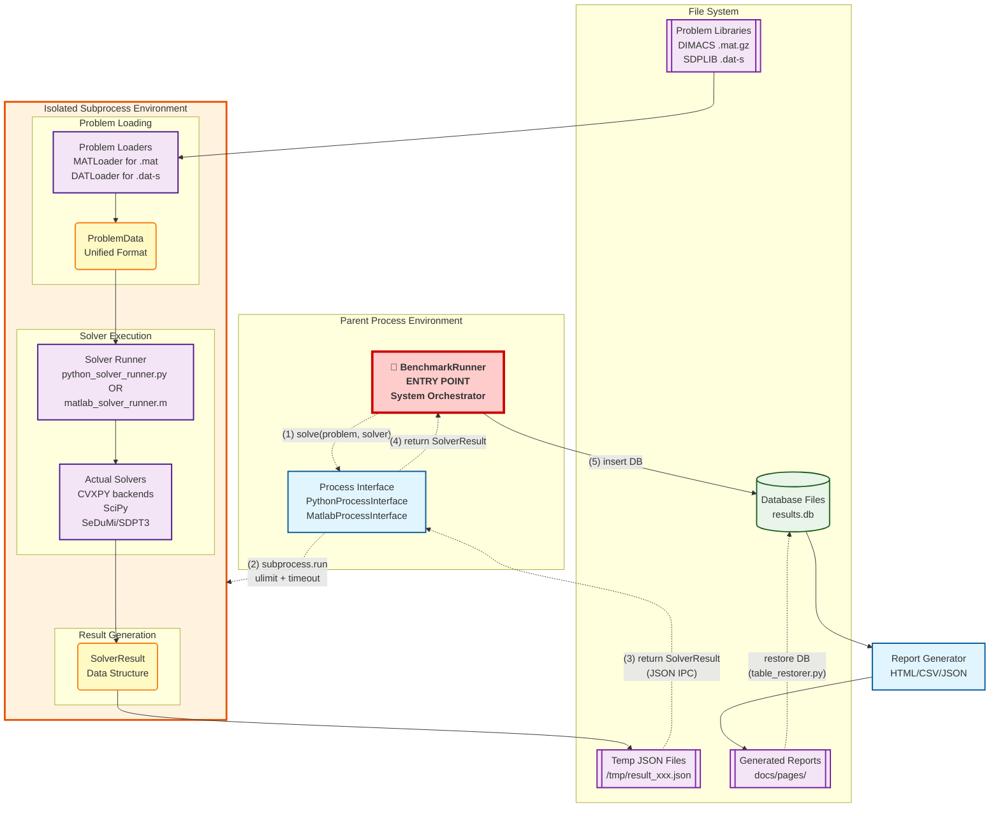

# Optimization Solver Benchmark System - Technical Design

Detailed technical specifications for the optimization solver benchmark system supporting Python and MATLAB solvers across LP, QP, SOCP, and SDP problems.

---

## System Overview

**Purpose**: Benchmark optimization solvers using external problem libraries (DIMACS, SDPLIB) with minimal configuration for unbiased performance evaluation.

**Core Components**:
- **Problem Loaders**: Parse MAT/DAT formats → standardized ProblemData
- **Solver Interfaces**: Execute Python/MATLAB solvers → standardized SolverResult  
- **Database Storage**: SQLite with complete version tracking
- **Report Generation**: HTML dashboards with CSV/JSON export

*For supported solvers, problem libraries, and problem types, see [basic_design.md](basic_design.md).*

---

## Project Structure

### Directory Layout
```
optimization-solver-benchmark/
├── main.py                     # Entry point with argument parsing
├── config/                     # Configuration files
│   ├── site_config.yaml        # Site metadata and overview
│   └── problem_registry.yaml   # Problem metadata and file paths
├── scripts/
│   ├── benchmark/              # Benchmark execution engine
│   │   ├── __init__.py
│   │   └── runner.py           # Main BenchmarkRunner class
│   ├── solvers/                # Solver interface implementations
│   │   ├── __init__.py
│   │   ├── solver_interface.py # Abstract base classes and SolverResult
│   │   ├── python/             # Python solver implementations (subprocess)
│   │   │   ├── __init__.py
│   │   │   ├── solver_configs.py            # Solver registry (single source of truth)
│   │   │   ├── python_process_interface.py  # Python subprocess coordinator
│   │   │   ├── python_solver_runner.py      # Subprocess entry point + solver manager
│   │   │   ├── cvxpy_runner.py              # CVXPY backend handler
│   │   │   └── scipy_runner.py              # SciPy linprog handler
│   │   └── matlab/      # MATLAB integration (subprocess)
│   │       ├── __init__.py
│   │       ├── matlab_process_interface.py  # Python-MATLAB subprocess bridge
│   │       ├── matlab_solver_runner.m       # MATLAB subprocess entry point
│   │       ├── sedumi_runner.m              # SeDuMi solver wrapper
│   │       ├── sdpt3_runner.m               # SDPT3 solver wrapper
│   │       ├── setup_matlab_solvers.m       # MEX compilation script
│   │       ├── sedumi/         # SeDuMi solver (git submodule)
│   │       └── sdpt3/          # SDPT3 solver (git submodule)
│   ├── data_loaders/           # Problem format loaders
│   │   ├── __init__.py
│   │   ├── problem_loader.py   # ProblemData class definition
│   │   ├── python/             # Python format loaders
│   │   │   ├── __init__.py
│   │   │   ├── problem_interface.py  # Problem loading coordinator
│   │   │   ├── mat_loader.py         # DIMACS .mat loader
│   │   │   └── dat_loader.py         # SDPLIB .dat-s loader
│   │   └── matlab/      # MATLAB format loaders
│   │       ├── mat_loader.m    # MATLAB .mat loader
│   │       └── dat_loader.m    # MATLAB .dat-s loader
│   ├── database/               # Database management
│   │   ├── __init__.py
│   │   ├── database_manager.py # Database operations
│   │   ├── models.py           # Data models
│   │   └── schema.sql          # Database schema
│   ├── reporting/              # Report generation
│   │   ├── __init__.py
│   │   ├── html_generator.py   # HTMLGenerator facade (public API)
│   │   ├── report_base.py      # Shared base class and HTML/CSS helpers
│   │   ├── overview_report.py  # Overview dashboard (index.html)
│   │   ├── results_matrix_report.py # Problems × Solvers matrix
│   │   ├── raw_data_report.py  # Raw data table
│   │   ├── data_index_report.py # Data export index page
│   │   ├── result_processor.py # Result aggregation
│   │   └── data_exporter.py    # JSON/CSV export
│   └── utils/                  # Utility modules (logging, env info, git, temp files)
├── tests/                      # pytest test suite
│   ├── unit/                   # Unit tests (synthetic fixtures, no submodules needed)
│   └── integration/            # Problem registry integrity checks
├── problems/                   # Problem library files
│   ├── DIMACS/                 # External DIMACS library (git submodule)
│   └── SDPLIB/                 # External SDPLIB library (git submodule)
├── database/                   # SQLite database files (results.db, gitignored)
├── docs/
│   ├── pages/                  # Generated HTML reports and data exports
│   ├── development/            # Design documents
│   └── guides/                 # User/setup guides
├── pyproject.toml              # pytest and ruff configuration
└── requirements.txt            # Python dependencies (single file, all pinned)
```

---

## Component Architecture

### System Data Flow

#### High-Level Process Flow with Sequential Steps



#### Node Legend and Execution Flow
- **🔴 Entry Point** `[]` (Red): **BenchmarkRunner** - Main system orchestrator and entry point
- **🔵 Processes** `[]` (Blue): Active execution components - Process Interface, Report Generator, Solvers
- **🟡 Internal Data** `()` (Yellow): Temporary in-memory data structures - ProblemData, SolverResult  
- **🟢 Database Storage** `[()]` (Green): Persistent database file - results.db
- **🟣 Document Files** `[[]]` (Purple): File-based documents - Problem Libraries, JSON Files, Generated Reports

#### Sequential Execution Steps
1. **(1) solve(problem, solver)**: BenchmarkRunner calls Process Interface with problem and solver names
2. **(2) subprocess.run**: Process Interface launches isolated subprocess with ulimit + timeout controls
3. **(3) return SolverResult (JSON IPC)**: Subprocess writes JSON result file, Process Interface reads and converts
4. **(4) return SolverResult**: Process Interface returns standardized SolverResult object to BenchmarkRunner
5. **(5) insert DB**: BenchmarkRunner stores result with complete metadata directly in results.db file


#### Error Detection and Status Flow
```
SUBPROCESS EXECUTION RESULTS:
┌─────────────────────┐    ┌─────────────────────┐    ┌─────────────────────┐
│ Return Code 0       │───▶│ Read JSON Result    │───▶│ Normal SolverResult │
│ (Success)           │    │ File                │    │ (OPTIMAL, etc.)     │
└─────────────────────┘    └─────────────────────┘    └─────────────────────┘

┌─────────────────────┐    ┌─────────────────────┐    ┌─────────────────────┐
│ Return Code -9/137  │───▶│ No JSON needed      │───▶│ SIGKILL Result      │
│ (SIGKILL)           │    │ (Process killed)    │    │ + Memory Limit Info │
└─────────────────────┘    └─────────────────────┘    └─────────────────────┘

┌─────────────────────┐    ┌─────────────────────┐    ┌─────────────────────┐
│ Timeout Expired     │───▶│ No JSON needed      │───▶│ TIMEOUT Result      │
│ (Process killed)    │    │ (Process killed)    │    │ + Timeout Duration  │
└─────────────────────┘    └─────────────────────┘    └─────────────────────┘

┌─────────────────────┐    ┌─────────────────────┐    ┌─────────────────────┐
│ Return Code ≠ 0     │───▶│ Parse stderr/stdout │───▶│ SUBPROCESS_ERROR    │
│ (Other errors)      │    │ for error details   │    │ + Error Message     │
└─────────────────────┘    └─────────────────────┘    └─────────────────────┘
```

### Component Responsibilities

**🚀 BenchmarkRunner** (System Orchestrator)
- Problem loading coordination
- Solver execution management
- Result storage and reporting

**Process Interfaces** (Subprocess Management)
- **PythonProcessInterface**: Python solver execution with resource control
- **MatlabProcessInterface**: MATLAB solver execution with resource control

**Data Components**
- **Problem Loaders**: MAT/DAT format parsers → unified ProblemData
- **DatabaseManager**: SQLite operations with version tracking
- **ReportGenerator**: HTML/CSV/JSON output generation

**Key Architecture Principles:**
- Subprocess isolation for crash protection
- Symmetric Python/MATLAB execution paths
- Unified resource control (timeout + memory limits)
- Centralized result storage and metadata tracking

---

## Core Data Models

### Problem Data Structure
```python
# scripts/data_loaders/problem_loader.py
class ProblemData:
    """Unified problem representation using SeDuMi format"""
    def __init__(self, name: str, problem_class: str):
        self.name = name                     # Problem identifier
        self.problem_class = problem_class   # 'LP', 'QP', 'SOCP', 'SDP'
        
        # SeDuMi standard format (internal representation)
        self.A_eq = None          # Constraint matrix (sparse)
        self.b_eq = None          # RHS vector
        self.c = None             # Objective coefficients
        self.cone_structure = {}  # Cone constraints specification
        
        # Optional QP data
        self.P = None             # Quadratic term matrix
        
        # Problem metadata
        self._num_variables = 0
        self._num_constraints = 0
        self.metadata = {}        # Additional problem information
```

### Solver Result Structure (Enhanced Error Detection)
```python
# scripts/solvers/solver_interface.py
@dataclass
class SolverResult:
    """Standardized result format for all solvers with comprehensive error detection"""
    solve_time: float                        # Execution time in seconds
    status: str                              # Status codes (see below)
    primal_objective_value: Optional[float] = None
    dual_objective_value: Optional[float] = None
    duality_gap: Optional[float] = None
    primal_infeasibility: Optional[float] = None
    dual_infeasibility: Optional[float] = None
    iterations: Optional[int] = None
    solver_name: Optional[str] = None
    solver_version: Optional[str] = None
    additional_info: Optional[Dict[str, Any]] = None
    
    # Status codes with clear error distinction:
    # OPTIMAL         - Solver found optimal solution
    # ERROR           - Solver-level error (convergence failure, numerical issues)
    # UNSUPPORTED     - Problem type not supported by solver
    # TIMEOUT         - Execution time limit exceeded
    # SIGKILL         - Process forcibly terminated (OOM, manual kill, resource limits)
    # SUBPROCESS_ERROR - Subprocess execution error (Python crash, library issues)
    
    @classmethod
    def create_error_result(cls, error_msg: str, solve_time: float = 0.0,
                          solver_name: str = "unknown", solver_version: str = "unknown") -> 'SolverResult':
        """Create standardized solver-level error result"""
        return cls(solve_time=solve_time, status='ERROR', 
                  solver_name=solver_name, solver_version=solver_version,
                  additional_info={'error_message': error_msg})
    
    @classmethod
    def create_timeout_result(cls, timeout_duration: float, solver_name: str = "unknown",
                            solver_version: str = "unknown") -> 'SolverResult':
        """Create standardized timeout result"""
        return cls(solve_time=timeout_duration, status='TIMEOUT',
                  solver_name=solver_name, solver_version=solver_version,
                  additional_info={'timeout_duration': timeout_duration})
    
    @classmethod
    def create_sigkill_result(cls, memory_limit_gb: Optional[float] = None, 
                            solve_time: float = 0.0, solver_name: str = "unknown",
                            solver_version: str = "unknown", error_details: str = "") -> 'SolverResult':
        """Create standardized SIGKILL result (process forcibly terminated)"""
        additional_info = {'error_type': 'SIGKILL', 'error_details': error_details}
        if memory_limit_gb is not None:
            additional_info['memory_limit_gb'] = memory_limit_gb
        return cls(solve_time=solve_time, status='SIGKILL',
                  solver_name=solver_name, solver_version=solver_version,
                  additional_info=additional_info)
    
    @classmethod
    def create_subprocess_error_result(cls, returncode: int, error_message: str,
                                     solve_time: float = 0.0, solver_name: str = "unknown",
                                     solver_version: str = "unknown") -> 'SolverResult':
        """Create standardized subprocess execution error result"""
        return cls(solve_time=solve_time, status='SUBPROCESS_ERROR',
                  solver_name=solver_name, solver_version=solver_version,
                  additional_info={
                      'returncode': returncode,
                      'error_type': 'SUBPROCESS_ERROR',
                      'error_message': error_message
                  })
```

---

## Configuration Specifications

### Problem Registry Structure

**Problem Configuration Schema:**
```yaml
# config/problem_registry.yaml structure
problem_name:
  display_name: string          # Human-readable problem name
  file_path: string            # Relative path to problem file
  file_type: string            # "mat" | "dat-s" | "mps" | "qps"
  library_name: string         # "DIMACS" | "SDPLIB" | "internal"
  for_test_flag: boolean       # Mark problem for validation testing
```

### Solver Interface Specifications

**Python Solver Interface:**
```python
class PythonProcessInterface:
    def solve(self, problem_name: str, solver_name: str,
              timeout: Optional[float] = None,
              memory_limit_gb: Optional[float] = None) -> SolverResult
```

**MATLAB Solver Interface:**
```python
class MatlabProcessInterface:
    def solve(self, problem_name: str, solver_name: str,
              timeout: Optional[float] = None,
              memory_limit_gb: Optional[float] = None) -> SolverResult
```

### Subprocess Architecture Design

**Key Design Principles:**
- **Process Isolation**: All solver execution in separate subprocesses for crash protection
- **Resource Control**: ulimit-based memory limits and timeout control
- **Unified Error Detection**: Standardized error classification across Python/MATLAB
- **JSON Communication**: Structured data exchange between parent and subprocess

---

## Database Implementation

### Schema Definition
```sql
-- scripts/database/schema.sql
CREATE TABLE results (
    id INTEGER PRIMARY KEY AUTOINCREMENT,
    
    -- Solver information
    solver_name TEXT NOT NULL,           -- 'cvxpy_clarabel', 'matlab_sedumi', etc.
    solver_version TEXT NOT NULL,        -- Full version with backend info
    
    -- Problem information  
    problem_library TEXT NOT NULL,       -- 'DIMACS', 'SDPLIB', 'internal'
    problem_name TEXT NOT NULL,          -- Problem identifier
    problem_type TEXT NOT NULL,          -- 'LP', 'QP', 'SOCP', 'SDP'
    
    -- Environment and execution context
    environment_info TEXT NOT NULL,      -- JSON string with system info
    commit_hash TEXT NOT NULL,           -- Git commit hash
    timestamp DATETIME DEFAULT CURRENT_TIMESTAMP,
    
    -- Standardized solver results
    solve_time REAL,                     -- Execution time in seconds
    status TEXT,                         -- 'OPTIMAL', 'INFEASIBLE', 'UNBOUNDED', 'ERROR', 'TIMEOUT', 'UNSUPPORTED'
    primal_objective_value REAL,        -- Primal objective value
    dual_objective_value REAL,          -- Dual objective value
    duality_gap REAL,                   -- Primal-dual gap
    primal_infeasibility REAL,          -- Primal constraint violation
    dual_infeasibility REAL,            -- Dual constraint violation
    iterations INTEGER,                  -- Number of solver iterations
    memo TEXT,                          -- Additional solver-specific info (JSON)
    
    UNIQUE(solver_name, solver_version, problem_library, problem_name, commit_hash, timestamp)
);

-- Indexes for efficient querying
CREATE INDEX idx_latest_results ON results(commit_hash, environment_info, timestamp DESC);
CREATE INDEX idx_solver_problem ON results(solver_name, problem_name);
CREATE INDEX idx_problem_type ON results(problem_type);
```

### Database Operations

**Core Operations:**
- **Result Storage**: Store SolverResult with complete metadata (environment, version, timing)
- **Query Interface**: Retrieve results by solver, problem, or time period
- **Version Tracking**: Maintain historical data with Git commit association

---

## Report Generation

**Report Types:**
- **Dashboard**: Interactive HTML reports with Bootstrap 5 + Chart.js
- **Results Matrix**: Problems × Solvers performance matrix
- **Data Export**: JSON/CSV formats for research use

**Output Formats:**
- HTML reports published to GitHub Pages
- JSON/CSV data files for programmatic access

---

## Fair Benchmarking Implementation

*For benchmarking philosophy and principles, see [basic_design.md](basic_design.md#design-philosophy).*

**Technical Implementation:**
- Solver configuration limited to output suppression (`verbose: false`)
- Unified resource limits via subprocess isolation
- Comprehensive version tracking in database metadata

---

## System Interface

### Timeout Control
- **Default timeout**: 120 seconds for most problems
- **Configurable limits**: Adjustable via command-line arguments
- **Subprocess isolation**: Timeout enforcement at process level

### Command-Line Interface

**Argument Processing:**
- **Problem Selection**: `--problems` (specific), `--library_names` (by library)
- **Solver Selection**: `--solvers` (specific), defaults to all available
- **Resource Control**: `--timeout` (seconds), propagated through all execution layers
- **Execution Modes**: `--benchmark`, `--validate`, `--report`, `--dry-run`

*For usage examples, see [basic_design.md](basic_design.md#problem-library-setup).*

---

## Development Guidelines

### Adding New Python Solvers
1. **Add an entry** to `scripts/solvers/python/solver_configs.py` (single source of truth; for a new CVXPY backend this is the only code change)
2. **Create a runner class** only if the solver is not a CVXPY backend (see `cvxpy_runner.py` / `scipy_runner.py`), and register it in `RUNNER_CLASSES` in `python_solver_runner.py`
3. **Add the dependency** to `requirements.txt` and the solver name to `display_order` in `config/site_config.yaml`
4. **Verify** with `python main.py --validate`

### Adding New MATLAB Solvers
1. **Create solver runner** `{solver}_runner.m` following standard interface
2. **Add configuration** to `MATLAB_SOLVER_CONFIGS` in `matlab_process_interface.py`
3. **Implement MEX compilation** in `setup_matlab_solvers.m`
4. **Verify** with `python main.py --validate`

### Adding New Problem Formats
1. **Create loader classes** in both `python/` and `matlab/` directories
2. **Add format mapping** to `FORMAT_LOADERS` in `problem_interface.py`
3. **Update problem registry** to include new format problems
4. **Implement format conversion** to unified SeDuMi format

---

This detailed design provides comprehensive implementation guidance while maintaining focus on research applications and eliminating unnecessary production complexity.